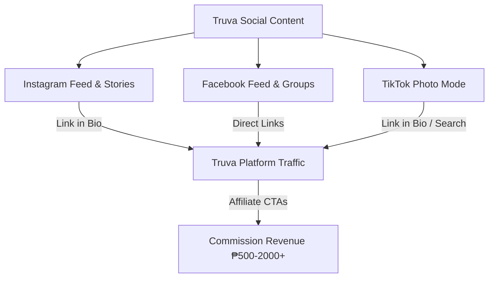

# Truva — Social Media & AI Cooperation Playbook
**Version:** 1.0 | **Last Updated:** June 2, 2026 | **Status:** Active

> **For the Founder and all AI Agents (Claude, Gemini, ChatGPT):** This playbook establishes the organic social media strategy and the multi-agent AI collaboration pipeline for Truva. It defines what content to post, how to maintain visual consistency matching the website style, and how to utilize standard $20 AI subscriptions and the Hermes agent to create a high-conversion traffic engine.

---

## 1. Growth Strategy & Channels

To grow Truva's traffic and drive credit card affiliate commissions without a marketing budget, we focus on **high-organic-reach visual channels**. 

### Target Audience & Tone
- **Audience:** Filipino Millennials and Gen-Z (Ages 24–36). First stable job or climbing the career ladder. Savings are growing, and they want their money to work harder. They are either looking for their first credit card or optimizing their wallet (cashback/miles).
- **Tone (The "Truva Way"):** Trusted financial guide. Honest, direct, and on the user's side. Plain English always (Grade 6–8 level). No banking jargon without a plain-English explanation right next to it.
- **Hook:** Uncovering the truth behind fine print. Showing the exact numbers banks advertise, but explaining clearly "what the catch is."

### Primary Social Media Channels



#### A. Instagram (Primary - Visual Authority)
- **Format:** Carousel slides (swipe-to-learn infographics) and interactive Stories.
- **Aesthetic:** Minimalist, high-end "Fintech Startup UI." Dark background cards, clean typography, and neon accent lines.
- **Goal:** Drive profile clicks to the "Link in Bio" routing users to the Truva credit card comparison lists.

#### B. TikTok Photo Mode (Primary - Organic Viral Hack)
- **Format:** Slideshows using TikTok's "Photo Mode" paired with trending sounds. 
- **Why this works:** Photo carousels get significantly higher organic distribution in the Philippines than static video right now. It takes zero video-editing or camera time for the founder, relying instead on clean, swipeable graphic cards.
- **Goal:** Broad impressions, comments, and search-driven traffic to gotruva.com.

#### C. Facebook (Secondary - Community Sharing)
- **Format:** High-contrast single graphics or 3-4 card clusters.
- **Distribution:** Shared on the official Truva page, boosted by context-specific responses in active personal finance communities.
- **Goal:** Direct clicks to /credit-cards and /banking/rates.

---

## 2. High-Converting Credit Card Content Pillars

To capture high-intent users who want to apply for credit cards (maximizing the ₱500–₱2,000+ payout per approved card), our content focuses on three primary pillars and one retention pillar.

```
┌─────────────────────────────────────────────────────────────────────────┐
│                     TRUVA SOCIAL MEDIA PILLARS                          │
├───────────────────┬───────────────────┬───────────────────┬─────────────┤
│     PILLAR A      │     PILLAR B      │     PILLAR C      │   SUPPORT   │
│ "What's the Catch"│   Card Battles    │  "No Fee for Life"│ Yield Pulse │
│ Fine-print truth  │    Head-to-head   │ Fee-free curations│ Rate updates│
└───────────────────┴───────────────────┴───────────────────┴─────────────┘
```

### Pillar A: "What's the Catch?" (Fine-Print Teardown)
Most Filipinos apply for cards based on fancy marketing but get hit by high annual fees or complex reward systems. We tear down popular cards in plain English.
- **Core Structure (The Three Questions):**
  1. *What is this card?* (One simple sentence explaining its main benefit).
  2. *Who is it for?* (The exact target user, e.g., "Frequent food-delivery spenders").
  3. *What's the catch?* (The hidden fee, high spend requirement, or capping rules).
- **Example Post:** *"What's the catch with the UnionBank Rewards Card?"* (Exposing the ₱20,000 spend requirement within 60 days to waive the annual fee).

### Pillar B: Card Battles (Side-by-Side Comparisons)
Direct, head-to-head comparisons of cards that look identical from the outside but are vastly different in value.
- **Core Structure:** A visual comparison table contrasting: Annual Fees, Cashback/Reward Rate, Minimum Income Requirement, and the Truva Verdict.
- **Example Battles:**
  - *UnionBank Rewards Card vs. HSBC Red Mastercard*
  - *Maya Card vs. GCash Card* (Digital bank debit/prepaid battle)
  - *HSBC Gold Visa Cash Back vs. Citi/UB Cashback*

### Pillar C: "No Fee for Life" (The Acquisition Magnet)
Annual fees are the #1 blocker for first-time credit card applicants in the Philippines. Lists of cards with permanent annual fee waivers perform exceptionally well.
- **Core Structure:** Roundups of currently active "No Annual Fee for Life" cards, highlighting which ones require zero spending to stay free.
- **Example Post:** *"3 credit cards that are free forever (No annual fee, ever)."*

### Supporting Pillar: Digital Bank Savings & Yield Pulse
Maintains our primary trust authority and keeps conservative savers engaged.
- **Core Structure:** Quick rankings of top liquid savings accounts and 6-to-12 month time deposits.
- **Rule:** Show gross rates exactly as advertised, but label them clearly as gross rates. Remind users to calculate after-tax math using the Truva site calculator.

---

## 3. The $20 AI Co-Op & Hermes Pipeline

As a solo founder, you can automate 90% of content production using your standard $20 monthly subscription stack and the Hermes desktop agent. The workflow runs sequentially:

```
┌─────────────────────────┐     1. Analyze rates, cards, & JSON
│ Gemini Advanced ($20)   │ ──> [Generates visual prompts & specs]
│   "Financial Analyst"   │
└─────────────────────────┘
             │
             ▼                  2. Write social captions & titles
┌─────────────────────────┐ ──> [Generates plain-English copy & hashtags]
│     Claude Pro ($20)    │
│   "Editor-in-Chief"     │
└─────────────────────────┘
             │
             ▼                  3. Generate visual images via DALL-E 3
┌─────────────────────────┐ ──> [Generates sleek Fintech startup UI card pngs]
│   ChatGPT Plus ($20)    │
│   "Graphic Designer"    │
└─────────────────────────┘
             │
             ▼                  4. Package assets & update metadata
┌─────────────────────────┐ ──> [Validates files and normalizes naming]
│      Hermes Agent       │
│    "Technical Packer"   │
└─────────────────────────┘
```

### Step-by-Step AI Co-Op Workflow

#### Step 1: Data Analysis & Visual Specification (Gemini Advanced)
- **Role:** The Financial Analyst.
- **How to use:** Paste your active credit card database schema, Supabase exports, or recent JSON logs into Gemini.
- **Handoff Prompt to Gemini:**
  ```text
  You are Truva's Financial Analyst. Analyze this data for [CARD_NAME] or [CARD_A vs CARD_B].
  1. Extract the core metrics: annual fees, rewards/cashback rate, spend requirements, and target persona.
  2. Write down the plain-English answers to: What is it? Who is it for? What's the catch?
  3. Draft a highly structured visual specifications table and a direct prompt for DALL-E 3 (following the Truva Visual Direction). Keep it clean, dark-mode, and structured like a fintech app interface.
  ```

#### Step 2: Copywriting & Content Packaging (Claude Pro)
- **Role:** The Editor-in-Chief.
- **How to use:** Paste Gemini’s analysis and visual specs into Claude. Claude writes the human-centric social copy.
- **Handoff Prompt to Claude:**
  ```text
  You are Truva's Editor-in-Chief. Using the financial data provided by our analyst, write an Instagram/TikTok Photo Carousel copy package.
  Rules:
  - Keep sentences short. One idea per sentence. Max Grade 6–8 reading level.
  - Draft a highly clickable title slide headline (e.g., "The catch behind the UnionBank Rewards card").
  - Write copy for 4 inside slides: (Slide 2: What is it, Slide 3: Who is it for, Slide 4: What's the catch, Slide 5: The Truva Verdict & CTA).
  - Draft the final social caption. Include a clear affiliate disclosure: "We earn a commission if you apply via the link in our bio. This doesn't change your rate."
  - Include 3-5 relevant local hashtags (e.g., #CreditCardsPH #PersonalFinancePH #DigitalBankingPH).
  ```

#### Step 3: Visual Asset Creation (ChatGPT Plus / DALL-E 3)
- **Role:** The Graphic Designer.
- **How to use:** Use ChatGPT Plus (which runs DALL-E 3 natively). Copy/paste the visual prompt drafted by Gemini.
- **Handoff Prompt to ChatGPT:**
  ```text
  Generate a clean social graphic matching our Fintech Startup UI style:
  [INSERT_GEMINI_IMAGE_PROMPT]
  ```

#### Step 4: Asset Normalization & Verification (Hermes desktop agent)
- **Role:** The Technical Packer.
- **How to use:** If you have local assets that need to be packaged into the Next.js repository or matched against static data:
- **Instructions for Hermes:**
  - Run name normalization on generated images: convert to lowercase, remove spaces, join alphanumeric words with underscores (e.g., `unionbank_rewards_catch.webp`).
  - Copy and verify that files exist in `public/cards/clean/` or `public/social/`.
  - Validate that reference files or metadata JSON link to active, matching files.

---

## 4. "Fintech Startup UI" Visual Direction

To ensure our social media channels look expensive and match the Truva website, we avoid generic AI cliches and enforce a **minimalist, sleek Fintech Startup UI aesthetic**.

```
┌─────────────────────────────────────────────────────────────┐
│                   VISUAL DIRECTIONS RULES                   │
├──────────────────────────────┬──────────────────────────────┤
│          DO USE              │           DON'T USE          │
├──────────────────────────────┼──────────────────────────────┤
│ Sleek dark credit cards      │ Cheesy cartoon 3D vectors    │
│ Minimalist UI phone wireframe│ Flying gold coins / cash bags│
│ White & Truva Blue (#0052FF) │ Multiple saturated colors    │
│ Clean charts & data bars     │ Cluttered lifestyle photos   │
│ Faint glassmorphic blur      │ Awkward AI people or hands   │
└──────────────────────────────┴──────────────────────────────┘
```

### Color Palette (Strict Coordination)
- **Backgrounds:** Dominant `#0A0B0D` (Rich black/dark grey).
- **Surfaces/Cards:** `#141519` (Elevated dark surface) or `#F8F9FB` (Light surface for high-contrast tables).
- **Brand Accents:** Truva Blue (`#0052FF`) for highlights, borders, and buttons.
- **Data Accents:** Positive Green (`#12B76A`) for positive metrics, Warning Yellow (`#F79009`) for requirements.
- **Typography:** Crisp, clean sans-serif text (Space Grotesk for headers, Inter for data).

### Banned Elements (High-Risk AI Failures)
To make sure DALL-E 3 images do not look cheap, these elements are **hard-excluded**:
- **No realistic human faces, hands, or bodies:** AI frequently fails on fingers and expressions, reducing trust.
- **No flying coins, bills, or golden piggy banks:** Extremely generic and screams "cheap affiliate site."
- **No illegible text embedded in the image:** DALL-E often scrambles small text. Keep graphics clean and abstract; let the post caption or overlaid text handle the reading.

---

## 5. Master Image Prompts (DALL-E 3 / Imagen 3 Templates)

Copy and paste these master templates into your image generator to get premium results:

### Template 1: Single Credit Card Focus (Sleek Dark Mode)
```text
A professional, ultra-premium product design mockup of a single sleek credit card. The card is styled like a modern fintech startup product, colored in deep matte black and elegant Truva Blue (#0052FF) accents. The credit card has a clean metallic chip, minimalist abstract card art, and a faint glowing blue outline. The card is resting on a dark, reflective matte black surface with subtle neon blue reflections. Clean, minimalist studio lighting. The background is a clean dark grey gradient with very subtle grid lines. Modern, expensive, dark-tech aesthetic. High-fidelity rendering, 16:9 aspect ratio. No text, no logos.
```

### Template 2: Card Comparison Battle (Head-to-Head UI)
```text
A minimalist fintech mobile application interface comparing two credit cards side-by-side. The left card is a sleek dark-matte card with silver accents. The right card is a premium dark-blue card with electric Truva Blue (#0052FF) outlines. The two cards are floating slightly above a clean, modern user interface dashboard showing abstract progress bars and comparison charts in light-grey and subtle positive green (#12B76A). Glassmorphism effect, soft shadows, pristine vector-like crisp shapes. Clean dark background #0A0B0D with subtle, faint glowing grid details on the right side. The left side is left as clean negative space. Modern, expensive digital banking style. No legible text, no watermarks, no cartoonish elements. 16:9 aspect ratio.
```

### Template 3: Savings Rate Yield Chart (Sleek Fintech Graph)
```text
A sleek, modern data visualization dashboard representing high-yield savings accounts. A glowing line chart in vibrant Truva Blue (#0052FF) and positive green (#12B76A) rises smoothly from left to right. Faint glassmorphic comparison cards float adjacent to the chart, showing abstract metrics, circular progress rings, and clean dividers. Visual style matches a premium financial app in light mode, set against a very clean light gray #F8F9FB background with thin elegant borders #E4E7EC. Subtle, realistic lighting, shadows, and high-fidelity rendering. Clean, professional, minimal, and premium fintech aesthetic. No legible text, no numbers, no logos. 16:9 aspect ratio.
```

---

## 6. Organic Traffic Loops & Conversion Rules

Driving impressions is only half the battle. We must guide users from social platforms onto gotruva.com to capture commissions.

### Link-in-Bio Setup & Funnels
Never link generically to the homepage. Route users directly to high-intent comparison paths:
- **Instagram Bio Link:** Use a clean routing page (like a Linktree or a dedicated `gotruva.com/social` path) containing:
  - `[👉 Find the Best Credit Card for You]` -> links to `gotruva.com/credit-cards`
  - `[💰 Top Digital Bank Savings Rates]` -> links to `gotruva.com/banking/rates`
  - `[📊 Calculate Your True After-Tax Yield]` -> links to `gotruva.com/calculator`
- **TikTok Bio Link:** Same routing structure once the link option is unlocked.

### Non-Negotiable CTA & Affiliate Disclosures
In the Philippines, transparency builds massive trust. We must state how we make money clearly.
- **Rule:** Every post that mentions a card or bank must include an affiliate disclosure in the copy.
- **Copy Template:**
  ```text
  👉 Compare rates, fees, and requirements side-by-side for free at gotruva.com (Link in bio!).
  
  Affiliate Disclosure: We earn a referral fee if you apply and get approved through our links. This costs you nothing and helps keep Truva free for everyone! We rank all cards honestly based on real numbers.
  ```

### The Defensive Reddit Strategy
As the founder noted, subreddits like `r/CreditCardsPH` or `r/DigitalBankingPH` are often moderated by competitors or direct businesses. Self-promotional links will get instantly banned.
- **Reddit Protocol (High-Trust, Unbranded):**
  - **Do NOT post promotional threads** about Truva or share direct affiliate links.
  - **Do search for questions** where users are confused about after-tax math or complex conditions (e.g., *"How does Maya's 15% interest tier work?"*).
  - **Write comprehensive, highly detailed, unbranded answers** explaining the exact math. 
  - **Add a quiet, helpful sign-off:** *"If you want to find the best rate, you can check out the free savings rate calculator on Truva. It does the math for you."* (Only include the name "Truva" as a helpful tool suggestion, not a direct link, which minimizes moderator flags while driving high-intent search traffic).
  - Use your personal account to act as a helpful peer. This builds authentic brand search volume.
