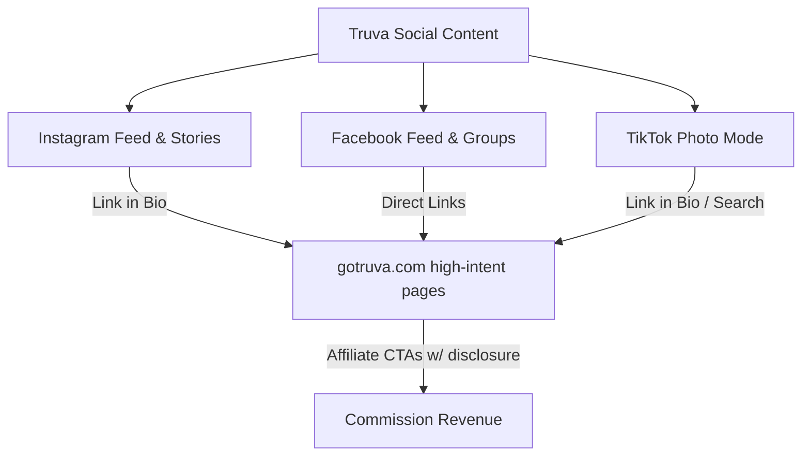

# Truva — Social Media & AI Cooperation Playbook (Corrected)
**Version:** 2.0 | **Last Updated:** June 2, 2026 | **Status:** Active
**Supersedes:** `SOCIAL_MEDIA_AI_STRATEGY.md` v1.0 (Gemini draft)

> **For the Founder and all AI agents (Claude, Gemini, ChatGPT):** This is the corrected organic social strategy and AI content pipeline for Truva. It is aligned with `TRUVA_MASTER.md` — read that first. The goal: grow traffic to gotruva.com and drive credit-card affiliate commissions, with content that is **fun and emotional enough to earn the click, but accurate and calm enough to earn trust.** Trust is the whole product. We never trade it for a punchier post.

> **What changed from v1.0 (and why):**
> 1. **Removed all "after-tax" framing.** v1.0 made "Calculate Your True After-Tax Yield" a primary funnel and built the Reddit play on after-tax math. That breaks Non-Negotiable Rule #3 (no after-tax shown to users) and mislabels `/calculator`, which is gross/advertised-rate only.
> 2. **Removed the "PDIC Split Calculator on Truva" reference.** That tool is not live — `/optimizer` currently redirects to the homepage. We never point people to a tool that does not exist.
> 3. **Switched visuals to light / white-first** to actually match the website (`--brand-bg #FFFFFF`). v1.0 was dark-mode-dominant and falsely claimed it matched the site.
> 4. **Dropped the hard "50+ credit cards" claim** until the live catalog supports it.
> 5. **Added a mandatory Fact-Check Protocol.** Every number in every post must be verified against the bank's own live page before posting. No exceptions. (This is the single biggest risk in AI-made finance content.)
> 6. **Re-aligned voice and affiliate disclosure** to the master brand.

---

## 1. Growth Strategy & Channels

To grow Truva's traffic and drive affiliate commissions without a paid budget, we focus on **high-organic-reach visual channels** built around clean, swipeable graphic cards.

### Target Audience & Tone
- **Primary for credit-card content (Phase 2):** Filipinos getting their first credit card or optimizing their wallet (cashback/miles). Mostly first stable job through early career.
- **Do not forget the wider brand audience.** Per `TRUVA_MASTER.md`, Truva also serves first-time savers and first-timers/under-served users (~50% of Filipinos are unbanked). Beginner-friendly framing is a feature, not a limitation — it is how we grow the market. Never assume the viewer already knows financial terms.
- **Tone (the "Truva Way"):** Trusted financial guide. Honest, direct, on the user's side. Plain English always (Grade 6–8). No banking jargon without a plain-English explanation right next to it.
- **The emotional hook (where the "fun" lives):** the *relief* of finally understanding the fine print, and the small thrill of "wait, that's the catch?!" We earn attention with curiosity and a strong hook — then deliver calm, exact truth in the numbers. **Fun in the hook, precise in the data.**

### Voice guardrails (so fun never costs us trust)
- **Headlines / title slides:** can be playful, curious, emoji-light, scroll-stopping.
- **The numbers (fees, rates, requirements):** calm and exact. No exclamation marks on a rate or fee. No "amazing!" / "huge!" on data. Let the truth do the work.
- **Emojis:** allowed as light signposts (one per slide heading max). Not sprayed through the data lines.
- **No Taglish in graphic copy** (matches UI rule). Captions may use light, natural Filipino phrasing if it reads warm and clear.

### Primary Channels



#### A. Instagram (Primary — Visual Authority)
- **Format:** Carousel slides (swipe-to-learn) and interactive Stories.
- **Aesthetic:** Clean, premium **light-mode** fintech UI (see §4). White and Truva Blue.
- **Goal:** Profile clicks → Link in Bio → credit-card and savings comparison pages.

#### B. TikTok Photo Mode (Primary — Organic Reach)
- **Format:** Photo-Mode slideshows paired with trending sounds.
- **Why it works:** Photo carousels currently get strong organic distribution and reward "saves" (educational, save-for-later content travels far). It needs zero video editing — just clean graphic cards. *(Supported by 2025 platform data; revisit quarterly as the algorithm shifts.)*
- **Goal:** Broad impressions, comments, and search-driven traffic to gotruva.com.

#### C. Facebook (Secondary — Community Sharing)
- **Format:** High-contrast single graphics or 3–4 card clusters.
- **Goal:** Direct clicks to `/credit-cards` and `/banking/rates`.

---

## 2. Credit Card Content Pillars

Three primary pillars (high-intent, highest affiliate payout) plus one retention pillar.

```
┌───────────────────┬───────────────────┬───────────────────┬─────────────┐
│     PILLAR A      │     PILLAR B      │     PILLAR C      │   SUPPORT   │
│ "What's the Catch"│   Card Battles    │  "Free For Life"  │ Rate Pulse  │
│ Fine-print truth  │    Head-to-head   │ Fee-free curations│ Savings/TD  │
└───────────────────┴───────────────────┴───────────────────┴─────────────┘
```

### Pillar A: "What's the Catch?" (Fine-Print Teardown)
Tear down a popular card in plain English. **The catch must be the *real, current* catch** — verified against the bank's live terms (see §3 Fact-Check Protocol). If a card genuinely has no annual fee for life, say so honestly, then surface the catch that *does* exist (interest rate, points-redemption math, foreign-transaction fees, etc.). Honesty about the good parts is what makes people believe us about the bad parts.
- **Structure (the Three Questions, same as every Truva product page):**
  1. *What is this card?* (one plain sentence)
  2. *Who is it for?* (the real target user)
  3. *What's the catch?* (the verified condition, fee, or limit)

### Pillar B: Card Battles (Side-by-Side)
Head-to-head comparison of two cards that look alike but differ in value.
- **Structure:** Visual table — Annual Fee, Cashback/Reward Rate, Minimum Income, Truva Verdict.
- **Every cell is a verified number.** A wrong number in a comparison is twice as damaging.

### Pillar C: "Free For Life" (Acquisition Magnet)
Annual fees are the #1 blocker for first-time applicants. Roundups of cards with **genuine permanent annual-fee waivers** perform well.
- **Rule:** Distinguish clearly between *"free for life, no conditions"* and *"waived only if you meet a spend requirement."* Getting this distinction wrong is the classic finance-content mistake — we exist to get it right.

### Supporting Pillar: Savings & Rate Pulse
Keeps our core savings authority alive and serves conservative savers.
- **Structure:** Quick rankings of top liquid savings accounts and time deposits.
- **Rule:** Show rates **exactly as the bank advertises them** (gross / advertised). Do **not** publish after-tax numbers. If context is needed, link to `/banking/rates`. Savings pages already carry the calm bottom disclosure that tax and bank charges are not deducted.

---

## 3. The AI Co-Op Pipeline + Mandatory Fact-Check

A solo founder can automate most production with the standard $20 AI stack — **but the model is the writer, never the source of truth.** LLMs confidently invent fees and requirements. Truva's own data and the bank's live page are the only sources we trust.

```
TRUVA DATA (Supabase / live site)  ← single source of truth
        │  feeds verified numbers
        ▼
┌──────────────────────────┐  1. Structure the facts + draft visual spec
│ Gemini Advanced ($20)    │     (must cite source URL per number)
│  "Financial Analyst"     │
└──────────────────────────┘
        ▼
┌──────────────────────────┐  2. Write plain-English caption + slide copy
│ Claude Pro ($20)         │     (Grade 6–8, brand voice, disclosure)
│  "Editor-in-Chief"       │
└──────────────────────────┘
        ▼
┌──────────────────────────┐  3. Generate light-mode fintech graphics
│ ChatGPT Plus / DALL·E 3  │     (visual prompts from §5)
│  "Graphic Designer"      │
└──────────────────────────┘
        ▼
┌──────────────────────────┐  4. FACT-CHECK GATE (human + bank's live page)
│ Founder / Hermes Agent   │     Nothing posts until this passes.
│  "Verifier & Packer"     │
└──────────────────────────┘
```

### 🔒 Fact-Check Protocol (non-negotiable — read before every post)
Before any post is marked "Ready-to-Post":
1. **Every number is verified against the bank's own live page or Truva's database** — annual fee, fee-waiver conditions, reward rate, minimum income, interest rate. Not the LLM's memory. Not last year's blog.
2. **Record the source + date** in the post's "Compliance" section (e.g., `Verified: unionbankph.com/rewards — 2026-06-02`).
3. **The "catch" must be currently true.** If you cannot confirm it today, the post does not ship.
4. **No invented precision.** If a payout or requirement is an estimate, label it as a range or mark it `[TO CONFIRM]`.
5. **When unsure, soften, don't fabricate.** "Most major PH credit cards, side by side" beats a made-up "50+."

### Step 1 — Gemini (Financial Analyst)
> You are Truva's Financial Analyst. Using the verified data I provide (from Truva's database and the bank's official page — not your own memory), structure the facts for [CARD] or [CARD A vs CARD B].
> 1. Extract: annual fee, fee-waiver conditions, reward/cashback rate, minimum income, monthly interest rate, target persona. For EACH number, cite the source URL I gave you. If a number is missing, say "NOT PROVIDED — do not guess."
> 2. Answer in plain English: What is it? Who is it for? What's the (verified) catch?
> 3. Draft a clean **light-mode** visual spec + a DALL·E 3 prompt following Truva Visual Direction (§4–§5).

### Step 2 — Claude (Editor-in-Chief)
> You are Truva's Editor-in-Chief. Using only the verified data above, write an IG/TikTok Photo carousel package.
> Rules:
> - Short sentences, one idea each, Grade 6–8.
> - Title slide = playful, curious hook. Data slides = calm and exact (no exclamation marks on numbers).
> - 4 inside slides: (2) What is it, (3) Who is it for, (4) What's the catch, (5) Truva Verdict + CTA.
> - Caption + affiliate disclosure (use the master wording in §6).
> - 3–5 local hashtags. Do not invent product facts; if a number is missing, write `[VERIFY]`.

### Step 3 — ChatGPT / DALL·E 3 (Designer)
> Generate a clean **light-mode** fintech graphic matching Truva's style: [INSERT GEMINI PROMPT]

### Step 4 — Verifier / Hermes (Packer)
- Run the Fact-Check Protocol above. Block anything unverified.
- Normalize image names: lowercase, no spaces, underscores (e.g., `unionbank_rewards_catch.webp`).
- Place files in `public/social/` (or `public/cards/clean/`); confirm metadata JSON points to real files.

---

## 4. "Light Fintech UI" Visual Direction (matches the website)

Truva's website is **white / light-first**. Social must match it so the brand feels continuous from feed to site.

```
┌──────────────────────────────┬──────────────────────────────┐
│           DO USE             │           DON'T USE          │
├──────────────────────────────┼──────────────────────────────┤
│ Clean white / light surfaces │ Dark-mode-dominant backgrounds│
│ Truva Blue accents on white  │ Multiple saturated colors    │
│ Minimalist UI / phone frames │ Cheesy 3D cartoon vectors    │
│ Crisp charts & data bars     │ Flying coins / cash / piggybanks│
│ Soft shadows, thin borders   │ Awkward AI people/hands/faces│
└──────────────────────────────┴──────────────────────────────┘
```

### Color Palette (from TRUVA_MASTER — strict)
- **Background:** `#FFFFFF` (white, dominant).
- **Surfaces / cards / table rows:** `#F8F9FB`. **Borders:** `#E4E7EC`.
- **Text:** `#0A0B0D` primary, `#5B616E` secondary/labels.
- **Brand accent:** Truva Blue `#0052FF` (buttons, highlights, key lines).
- **Data accents:** Positive Green `#12B76A` (good metrics), Warning Yellow `#F79009` (conditions/requirements), Danger Red `#F04438` (risk labels only).
- **Typography:** Space Grotesk (headers), Inter (data/body). Figures use tabular numerals.

### Banned elements (high-risk AI failures)
- No realistic human faces, hands, or bodies (AI mangles them, kills trust).
- No flying coins, bills, or golden piggy banks (screams "cheap affiliate site").
- No illegible embedded text (DALL·E scrambles small text — keep graphics abstract; overlay real text in Canva/IG).

---

## 5. Master Image Prompts (Light Mode)

### Template 1 — Single Credit Card (Clean Light)
```text
A professional, ultra-premium product mockup of a single sleek credit card, styled like a modern fintech startup product in white and elegant Truva Blue (#0052FF) accents. Clean metallic chip, minimalist abstract card art, soft blue edge highlight. The card rests on a clean, bright white surface (#FFFFFF) with a very subtle light-grey gradient and faint thin grid lines (#E4E7EC). Soft natural studio lighting, gentle shadows. Modern, premium, trustworthy light-mode fintech aesthetic. High-fidelity, 16:9. No text, no logos.
```

### Template 2 — Card Battle (Head-to-Head, Light UI)
```text
A minimalist light-mode fintech app interface comparing two credit cards side by side. Both cards float slightly above a clean white dashboard (#FFFFFF) showing abstract progress bars and comparison charts in light grey (#F8F9FB) with subtle positive-green (#12B76A) and Truva Blue (#0052FF) highlights. Thin elegant borders (#E4E7EC), soft shadows, crisp vector-like shapes. Bright, premium, trustworthy digital-banking style. No legible text, no watermarks, no cartoonish elements. 16:9.
```

### Template 3 — Savings Rate Chart (Light Fintech Graph)
```text
A sleek light-mode data-visualization dashboard for high-yield savings. A smooth rising line chart in Truva Blue (#0052FF) and positive green (#12B76A) on a clean white background (#FFFFFF). Faint light-grey comparison cards (#F8F9FB) with circular progress rings and thin dividers (#E4E7EC). Soft realistic lighting and shadows, high-fidelity. Clean, professional, minimal, premium fintech. No legible text, no numbers, no logos. 16:9.
```

---

## 6. Traffic Loops, CTAs & Disclosure

Driving impressions is half the job. We guide users from social onto gotruva.com to capture commissions.

### Link-in-Bio Funnels (never link to the bare homepage)
Route to high-intent pages:
- `[👉 Find the right credit card for you]` → `gotruva.com/credit-cards`
- `[💰 Top digital-bank savings rates]` → `gotruva.com/banking/rates`
- `[📊 See your estimated earnings (advertised rates)]` → `gotruva.com/calculator`

> **Note:** The calculator shows **advertised / gross** estimates only — never label it "after-tax" or "true yield after tax." That violates Rule #3 and misdescribes the tool. Do **not** reference a "PDIC Split Calculator" until `/optimizer` is actually built (it currently redirects to home).

### Affiliate Disclosure (aligned to TRUVA_MASTER)
Every post that names a card or bank must carry a disclosure. Use this wording:
```text
👉 Compare fees, rewards, and requirements side by side, free, at gotruva.com (link in bio).

Affiliate Disclosure: We earn a fee if you apply and get approved through our links. This does not change what you are offered, and it keeps Truva free. We rank every card honestly, based on real numbers.
```

### The Defensive Reddit Strategy (high-trust, unbranded)
PH finance subreddits are often moderated by competitors; self-promo gets banned fast.
- **First, confirm the real communities.** Verify exact subreddit names before relying on them (e.g., r/phinvest is the established hub; do not assume a handle exists — check it).
- **Do NOT** post promo threads or drop affiliate links.
- **Do** find questions where people are confused about a card's conditions or how a savings tier works, and write thorough, genuinely helpful, **unbranded** answers in plain English (explain the mechanics and the advertised rates — not after-tax math).
- **Quiet sign-off, only when truly helpful:** mention Truva as a free place to *compare rates and fees side by side* (e.g., "you can compare these side by side for free on Truva") — the tool you cite must actually exist and be live. Use your personal account as a helpful peer. This builds branded search demand without tripping mod filters.

---

## 7. Pre-Post Checklist (pin this)
- [ ] Every fee, rate, requirement **verified on the bank's live page today** (source + date logged).
- [ ] The "catch" is **currently true**.
- [ ] No after-tax / "true yield" language anywhere.
- [ ] No reference to tools that aren't live (e.g., PDIC split optimizer).
- [ ] Visuals are **light-mode**, brand colors, no banned elements.
- [ ] Affiliate disclosure present, master wording.
- [ ] No exclamation marks on data; hook can be playful.
- [ ] Numbers you couldn't confirm are marked `[VERIFY]`, not shipped.
- [ ] Link goes to a high-intent page, not the bare homepage.
