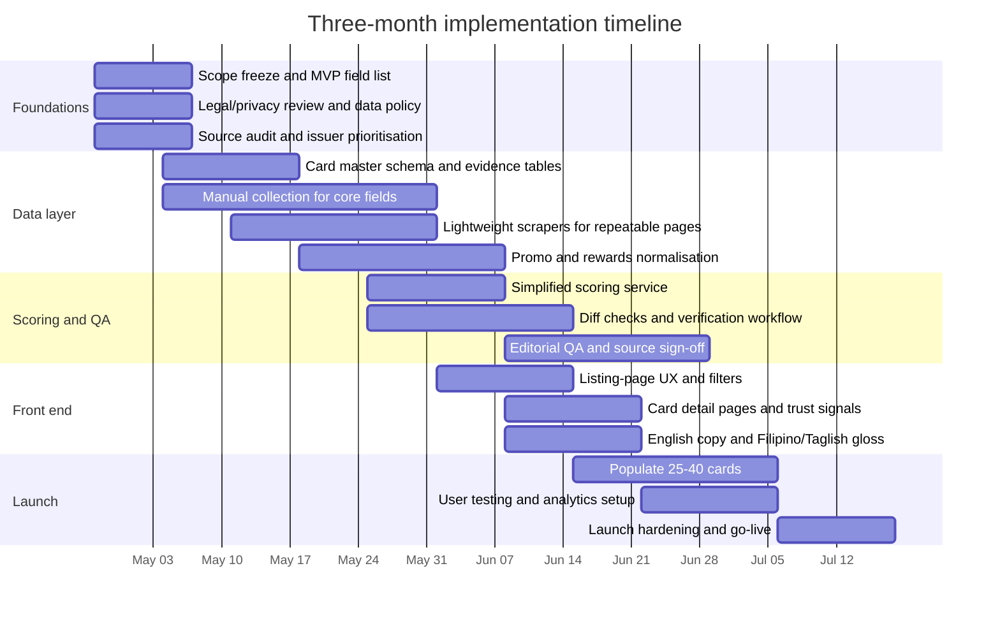

# Launching a Credit Card Ranking Category in the Philippines

## Executive summary

Your uploaded methodology is unusually ambitious for a first launch: it is multi-profile, multi-rubric, fine-print-aware, and it assumes a large, continuously verified evidence base with frequent refreshes. As a **backend standard**, that is a strength. As a **first-screen user experience** for much of the Philippine market, it is probably too technical if exposed in full. Official Philippine data points to a market that is highly mobile and increasingly digital, but still uneven in financial comprehension and confidence: the 2025 consumer finance survey reports 90% mobile-phone penetration and 89% internet use among adults, and the 2024 BSP e-payments measurement says digital retail payments already account for 57.4% of transaction volume; yet the PSA’s 2024 literacy survey puts functional literacy at 70.8%, and the BSP still finds awareness gaps concentrated among rural, older, and lower-income users. Your engine can stay complex; your **front end should not**. fileciteturn0file0 citeturn12view2turn11view3turn22view0turn13view2

The best reading of the evidence is that the methodology is **too detailed for mass-market presentation, but not too detailed for mass-market recommendation quality**. In other words, the scoring model can remain sophisticated if the page the user sees is simplified into a standardised comparison card, plain-language rationale, a few trust signals, and one or two user-controlled ranking modes. That conclusion is strongly aligned with official Philippine digital-finance guidance: digital interfaces should be easy to understand, simple, customer-centric, suited to low-end devices, and explicit about costs and risks; and BSP research on Philippine credit choice finds that standardised displays and attribute-based ranking improve choice quality more reliably than marketing-style presentation. citeturn32view0turn11view5turn30view0turn30view1turn30view3

Segment by segment, the fit is different. For the **mass market**, the model should power recommendations quietly in the background. For **affluent users**, the extra detail is a commercial advantage: high-income users are materially more likely to hold formal accounts and engage with insurance and investment products, so travel, FX, lounge, and transfer-partner detail is worthwhile. For **SMEs**, the fit is weaker unless you build a separate rubric. Official sources on business owners and MSMEs point more toward rate, cash-flow practicality, tenor, ease of application, and digital-operational usefulness than toward lifestyle rewards engineering. citeturn20view0turn14view0turn16view2

A **three-month launch is realistic only as a constrained MVP**. If you aim for roughly 25–40 cards, public data only, weekly refreshes, and a simplified scoring system, you can launch a credible category. If you aim to reproduce the current methodology as written — including full-universe coverage, multi-source verification, near-real-time refresh, insurance actuarial valuation, merchant and MCC mapping, approval accessibility heuristics, devaluation monitoring, and community-review modifiers — the project becomes high difficulty and extends well beyond one quarter. Your own methodology document is directionally correct that the real moat is the database, not the formula. fileciteturn0file0

## Market fit in the Philippines

A useful starting point is that the Philippine market is now **digital enough to browse and compare cards online**, but not uniform enough to assume that everyone will comfortably parse eight pillars, multiple weights, points valuations, actuarial estimates, and waiver-probability math. The most recent national BSP consumer finance survey says 90% of adults have a mobile phone and 89% use the internet, while PSA data shows that 36.7% of internet users purchased goods or services online in 2024, with smartphones remaining the dominant device. The BSP’s 2024 e-payments report adds that 57.4% of retail payment volume was digital. That is strong evidence for an online comparison experience — but specifically a **mobile-first comparison experience**. citeturn12view2turn11view4turn11view3

At the same time, official literacy and finance data argue against a heavily technical first impression. The PSA reports a 70.8% functional literacy rate among those aged 10 to 64 in 2024. The BSP’s 2025 survey says 74% of adults could answer at least half of six financial-literacy questions, but still notes weaker understanding of interest rates, especially compound interest. It also reports that only 64% verify whether providers are regulated before using online financial services, and that awareness of provider responsibilities and BSP assistance mechanisms remains limited for rural, older, and lower-income groups. Added to that, the BSP financial inclusion dashboard still shows a relatively narrow credit-card base — 8.1% of adults in the latest Findex-backed statistic published there. That means the audience for a card-ranking category is not “all Filipino adults”; it is a **more banked, more urban, more digitally comfortable subset** of the population. citeturn22view0turn12view1turn13view2turn20view0

For the **mass market**, the practical implication is clear. This segment is large enough to justify the category, but it will respond better to **direct consumer outcomes** than to scoring theory. The page should answer: “How much can I save or earn?”, “Can I qualify?”, “What is the annual fee really?”, “Is this good for groceries, travel, or online shopping?”, and “Why is this ranked here?”. The backend may use multiple variables to arrive there; the page should not require the user to mentally value miles, insurance exclusions, MCC restrictions, or devaluation risk before they can make sense of a ranking. Official BSP guidance for digital financial services explicitly pushes providers toward simple interfaces, low-friction disclosure, highlighted key facts, and language that matches consumers’ sophistication. citeturn32view0turn11view5turn33view0

For the **affluent segment**, however, more granularity is not merely tolerable — it is likely differentiating. The BSP dashboard shows formal account ownership at 80% among socio-economic class ABC, versus 54% for class D and 44% for class E. The 2021 financial inclusion report also shows class ABC and higher-education groups are more likely to save, invest, and own insurance. That is the audience most likely to care about foreign transaction fees, lounge entitlements, transfer ratios, tiered insurance, and statement-credit conversion values. For this segment, an “advanced details” tab or expandable methodology panel is an asset, not a liability. citeturn20view0turn13view0

For **SMEs and business owners**, your current methodology is only a partial fit. The BSP dashboard shows business owners with higher formal-account ownership than the population average, and the BSP’s 2021 financial inclusion work indicates that business owners are more likely to borrow from banks than many other groups. But the same source also says business owners care heavily about interest rate, loan amount, ease of application, and tenor, and that many find bank application processes difficult. The DTI’s MSME digitalisation baseline study also treats Philippine MSMEs as a heterogeneous population spanning basic, intermediate, and advanced ICT use. That combination suggests SME users are not best served by a consumer-lifestyle-heavy card score alone. If SMEs matter strategically, they warrant a **separate business-spend rubric** or a later dedicated category, not a borrowed version of a household-consumption model. citeturn20view0turn14view0turn16view2

## Product detail, language, and trust

Official Philippine guidance is unusually helpful on what your front-end experience should look like. The BSP’s consumer-protection rules require disclosure that is clear, concise, accurate, understandable, and not misleading, and specifically say that for digital products the terms should be easily accessible rather than buried several screens deep. The Financial Sector Forum’s consumer-protection guidelines for fintech go further: the interface should be easy to access, understand, and use; key facts should be highlighted for complex products; full price and charges should be clear; the design should be customer-centric and optimised for low-end mobile devices; and tooltips or interactive text should be used where extra detail is needed. Put plainly, the regulator’s own standard favours an experience that is **simple up front, detail-rich on demand**. citeturn11view5turn32view0

That is also what BSP research on Philippine credit choice points toward. In its 2025 discussion paper on digital credit, the BSP found that standardising product information led users to choose more favourable products than they did under traditional marketing-style presentation. It also found that ranking by a chosen attribute influences consumer choice, and it explicitly tested an interface where users choose which attribute to rank by. At the same time, the paper warns that forcing a pure price-based ranking may not maximise welfare where consumers legitimately care about non-price attributes. That maps almost perfectly onto your situation. A single “true value” score can exist, but the interface should also expose **user-controlled sorting by annual fee, cashback value, travel value, low FX fee, and likely eligibility**. citeturn30view0turn30view1turn30view3

On **language**, the official evidence supports a bilingual or near-bilingual approach, not a full Filipino-only rewrite. The BSP’s 2025 survey overview lists Filipino and English as the country’s languages, and the same survey presents core consumer-rights wording in Filipino alongside English. BSP Circular 1160 also requires complaint and access channels to be adapted to consumers’ level of literacy and to local specifications such as language or dialect. The practical conclusion is that a launch can be **English-first**, because that matches most bank card pages today, but it should include **plain-English wording plus Filipino or Taglish support** for key concepts: annual fee, minimum income, foreign transaction fee, waiver rule, late fee, points value, and “what this means for you”. A full bilingual glossary is likely enough for launch; a full Filipino-language overlay can follow if data shows demand. citeturn12view2turn12view0turn33view0

On **trust**, Philippine official sources point to the same signals repeatedly: regulated status, complaint pathways, transparent disclosures, and visible recourse. The fintech consumer-protection guidelines say digital communications should identify the regulated entity and provide regulator contact information. The BSP maintains a directory of supervised institutions and a directory of consumer-assistance channels; the PDIC maintains an insured-bank directory; and the DTI Trustmark explicitly treats visible official trust markers as a consumer-confidence mechanism in digital commerce. For your website, the highest-value trust features are therefore very concrete: **last verified date**, **how we scored this**, **partner/non-partner disclosure**, **regulated issuer badge**, **link to complaints/help channels**, **no dark-pattern CTAs**, and **privacy notice**. Those will matter more in the Philippine market than exposing weight matrices on the listing page. citeturn21view0turn21view2turn21view3turn32view0turn11view5

## Data inventory and source accessibility

The table below is a launch-oriented synthesis based on official regulator requirements and directories, plus current sample issuer pages from entity["company","BDO Unibank","philippine bank"], entity["company","Bank of the Philippine Islands","philippine bank"], and entity["company","RCBC","philippine bank"], together with guidance from entity["organization","Bangko Sentral ng Pilipinas","philippine central bank"], entity["organization","Philippine Deposit Insurance Corporation","philippine deposit insurer"], entity["organization","National Privacy Commission","philippine privacy regulator"], entity["organization","Philippine Statistics Authority","philippine statistics agency"], and the entity["organization","Department of Trade and Industry","philippine trade ministry"]. citeturn11view6turn11view5turn21view1turn21view2turn28search1turn28search0turn28search5turn29search3turn29search4

| Field group | Typical fields | Likely Philippine sources | Accessibility | Difficulty | Launch recommendation |
|---|---|---|---|---|---|
| Issuer metadata | legal issuer name, bank/non-bank, regulated status, consumer-assistance contact, PDIC-insured bank status | BSP institution directory; BSP assistance-channel directory; PDIC bank directory | Public | Low | Include from day one |
| Card identity | card name, family, network, tier, billing currency | Issuer product pages and card T&Cs | Public | Low | Include from day one |
| Network and brand | network, premium tier, lounge/network perks | Issuer pages; network docs from entity["company","Visa","payments network"] / entity["company","Mastercard","payments network"] | Public | Low | Include from day one |
| Pricing core | annual fee, supplementary fee, annual-fee waiver rule, no-annual-fee-for-life status | Issuer fee tables, card T&Cs, application pages | Public but fragmented | Medium | Include from day one |
| APR-equivalent / finance charge | monthly finance charge, annual rate, EIR, instalment add-on rate | Issuer T&Cs; BSP comparative tables; MORB disclosure rules | Public but inconsistent in format | Medium | Include from day one; normalise internally |
| Penalty fees | late fee, over-limit fee, cash advance fee, card replacement fee, instalment conversion fee | Issuer fee tables and T&Cs; BSP fee tables | Public | Medium | Include from day one |
| FX costs | FX conversion fee, cross-border fee, DCC treatment, by-network nuances | Issuer fee tables and T&Cs | Public but multi-component | Medium–High | Include from day one, but version very carefully |
| Eligibility | minimum income, age, residency, minimum documentary requirements | Issuer application pages and T&Cs | Public | Low | Include from day one |
| Rewards earn rules | base earn, category multipliers, spend caps, exclusions, expiry | Issuer rewards pages, card T&Cs, promo mechanics, FAQs | Public but scattered | High | Include only for major categories at launch |
| Rewards value and transfer partners | cash-equivalent conversion, airline transfers, shopping-credit value, transfer ratios | Issuer rewards/redemption pages; airline programme pages; manual valuation model | Mixed public/manual | High | Simplify at MVP; avoid full valuation table initially |
| Welcome bonus | promo value, spend threshold, window, issuance channel, exclusions | Issuer promo pages and promo-mechanics PDFs | Public but high-churn | High | Include only active public offers, with expiry date |
| Merchant promos | dining/travel/shopping perks, cashback campaigns, category promos | Issuer promo pages; merchant pages; DTI/FTEB promo info where shown | Public but very volatile | High | Treat as supplementary, not core score input |
| Instalment ecosystem | merchant lists, tenor, minimum spend, in-store/online flags, BNPL | Issuer instalment-program pages; merchant pages | Public but fragmented and unstable | High | Store as badges or counts first, not deep scoring |
| Insurance and protections | travel accident, travel medical, baggage, purchase protection, underwriter, exclusions | Issuer card pages; certificate/policy PDFs; underwriter documents | Mixed; sometimes hidden in PDFs | High | Use simple yes/no tiering first; defer actuarial values |
| Acceptance and wallet support | contactless, mobile-wallet support, network acceptance notes | Issuer help pages; network docs | Public | Medium | Include only if you can verify cleanly |
| Issuer experience signals | app availability, app ratings, service channels, complaint channel | App stores; BSP assistance directory; issuer support pages | Mixed public | Medium | Use support/contact and app presence first |
| Complaint index and approval odds | public complaint rate by issuer/card, approval rate by profile, thin-file or OFW odds | Mostly internal regulatory reporting, proprietary datasets, or community submissions | Behind login / proprietary / privacy-sensitive | Very High | Do not use in MVP score |
| MCC coverage maps and exclusion logic | exact MCC inclusion/exclusion by spend category, e-wallet restrictions, merchant match confidence | T&Cs, issuer FAQs, transaction testing, community evidence | Mixed; often inferential | Very High | Avoid full MCC scoring at launch |

The **easiest** fields are issuer identity, regulated status, network, annual fee, core finance charge, minimum income, and major fee items. Philippine regulation already requires banks to disclose finance charges, fees, and key conditions, and BSP maintains directories that help with issuer verification and recourse. Those fields are good enough to power a solid first release. citeturn11view6turn21view0turn21view1turn21view2

The **hardest** fields are not the headline ones users think about. They are the ones your methodology relies on for differentiation: rewards valuation, spend-cap logic, exact exclusions, underwriter-backed insurance detail, merchant-installment depth, approval accessibility by user type, complaint-index granularity, and dynamic promos. The sample issuer pages show why. BDO’s FX structure and fee schedules vary by card family and effective date; BPI and RCBC rewards and promo mechanics are split across multiple pages; and merchant-based instalment offers are often campaign-specific or merchant-specific rather than delivered through a stable master feed. citeturn28search1turn28search13turn28search0turn28search5turn29search3turn29search4turn29search11

I would also **not** plan the launch around aggregator APIs. The official Philippine “open finance” framework is about customer-permissioned data sharing among institutions and third parties; it is not, at least in the official materials reviewed, a ready-made public catalogue API for card-comparison websites. In practice, that means issuer-by-issuer collection and normalisation will remain your primary path, with third-party providers serving only as optional accelerants. citeturn31search1turn31search3

## Regulatory and operational constraints

On law and regulation, the first correction is terminology: in the Philippines the relevant privacy law is the **Data Privacy Act of 2012**, not a separate local “PDPA”. It applies to personal-information processing generally, and that matters to you as soon as the site collects user profiles, income bands, spending inputs, reviews, saved preferences, or any behavioural data tied to individuals. If you later personalise rankings and persist those profiles, you are in privacy-governance territory even if you are not underwriting credit yourself. citeturn11view9

That becomes more concrete if your system involves **profiling**. NPC Circular No. 2022-04 expressly covers automated decision-making or profiling in the context of data-processing-system registration, and the NPC’s FAQs say registration obligations apply where entities cross certain thresholds or where processing is likely to pose risk to data subjects’ rights and freedoms. For a comparison site, the practical reading is not that you are prohibited from using personalised scoring. It is that you should design the site so the personal data collected is minimal, the logic is explainable, the retention period is defined, and the privacy documentation is prepared early rather than after launch. citeturn26search0turn26search3turn26search6

On **web scraping**, the key legal nuance is this: product data is easier to work with than personal data, but the moment you scrape identifiable user comments, profiles, public social content, or other personal data, the NPC’s new 2026 guidance applies directly. NPC Advisory No. 2026-01 says publicly available personal data is still protected under the Data Privacy Act; purpose, lawful basis, notice, proportionality, and security still matter; and bypassing technical controls or terms of service can amount to unauthorised scraping. So for a card-ranking launch, conservative practice is to scrape **public issuer product content only**, store snapshots and source URLs, respect terms and robots where applicable, and avoid scraping personal-content sources for trust or sentiment signals until you have legal review. citeturn9view0

On **financial consumer protection**, the BSP framework is actually favourable to your product concept — if you implement it carefully. Republic Act No. 11765 and BSP Circular No. 1160 emphasise fair treatment, disclosure and transparency, data privacy, fraud protection, and timely redress. The MORB requires credit-card fee and finance-charge disclosure, including itemised fees and rates. Circular 1160 also says consumer channels should be adapted to users’ literacy and local language or dialect, and that simple, accessible guides and complaint routes should be available via websites and digital channels. Operationally, that means your scoring labels, fee explanations, eligibility filters, and affiliate disclosures must be **clear enough to survive regulatory scrutiny as well as user scrutiny**. citeturn25view1turn11view6turn11view5turn33view0

The biggest non-legal barrier is **change frequency plus standardisation cost**. Promos are highly time-bounded; rewards and FX fee schedules change; merchant partnerships vary by issuer and category; and the same logical field may be expressed differently across banks. Some pages are narrative marketing pages, others are table-based PDFs, and others are promo mechanics hidden behind “read more” interactions. This is why the backend challenge is mostly data operations, not math. A ranking formula can be written quickly. A versioned, auditable, trustworthy card database cannot. citeturn28search1turn29search3turn29search4turn29search11turn32view0

## Feasibility and launch scenarios

The most realistic way to think about effort is to separate **fact collection** from **scoring**. Scoring is relatively easy once the fact layer is stable. Fact collection is where time disappears: building the schema, setting source priorities, parsing and normalising issuer wording, setting effective dates, handling promo expiry, and running QA. That is also consistent with the uploaded methodology’s central thesis that the database is the moat. fileciteturn0file0

The table below gives realistic launch scenarios. These are **indicative estimates**, not vendor quotes. They assume a mixed team of in-house and contracted support, no native mobile app build, and a website category launch rather than a full marketplace.

| Scenario | Assumptions | Data engineering | Collection approach | Update cadence | Indicative timeline | Indicative effort / cost band | Realistic verdict |
|---|---|---|---|---|---|---|---|
| Low | 25–40 cards; 3–4 categories; public fields only; no deep insurance or MCC scoring; simple filters and badges | Light-to-moderate | Mostly manual curation with light scraping and source logging | Weekly refresh; urgent promo hotfixes | 6–8 weeks | ~2–3 FTE-months; roughly US$15k–40k if outsourced | Feasible, but differentiation is modest |
| Medium | 40–80 cards; simplified score; 4 main rubrics; versioned source store; change detection for major issuers; bilingual glossary | Moderate | Hybrid: scraping for structured fields, manual verification for dynamic content | Weekly scheduled refresh plus event-driven fixes | 8–12 weeks | ~5–8 FTE-months; roughly US$40k–120k | Best fit for a 3-month launch |
| High | 120–150 cards; near-full methodology; merchant and promo depth; insurance detail; approval heuristics; advanced QA | High | Multi-source collectors plus substantial analyst workflow | 48-hour SLA target | 6–12 months initial build, then ongoing | ~20–40+ FTE-months; roughly US$150k–500k+ first year | Not realistic as a first 3-month release |
| Very high | Full methodology exactly as implied, with database moat, full-universe recertification, community modifier, actuarial and devaluation layers | Very high | Continuous data-operations programme | Near-real-time or 48-hour verified changes | 12–24 months to reach comfortable operating maturity | Material ongoing ops team required | Strategic destination, not launch plan |

The **workstream-level difficulty** is also uneven. **Data engineering** for an MVP is manageable if you keep the schema opinionated: one card master, one source-evidence table, one promo table, one rewards table, one scoring output table. **Scraping/APIs** are medium difficulty for launch and high difficulty later: issuer product pages are scrapeable in principle, but promo pages, PDFs, and T&Cs need manual fallback. **Manual curation** is unavoidable from day one because a large share of card detail is expressed in prose, PDFs, or channel-specific promo mechanics. **Update cadence** is where operational promises become dangerous: weekly is realistic for an MVP; 48 hours across a full market is expensive. **QA** is not optional — you need field-level source links, effective dates, and reviewer sign-off, otherwise trust collapses the first time a user spots a stale promo or wrong fee. citeturn11view6turn28search1turn28search5turn29search3turn29search4

For faster launch, there are three practical scoring alternatives.

**Filter-first model.** No single score. Users filter by annual fee, no-annual-fee-for-life, cashback vs travel, minimum income, and low FX fee, then sort by a selected attribute. This is the fastest and lowest-risk option, and it aligns well with BSP evidence that attribute ranking can improve choice. The trade-off is weaker differentiation and thinner SEO storytelling. citeturn30view0turn30view3

**Simple score model.** Use a small number of public variables only: net annual value, fee burden, likely eligibility, and issuer trust/support. This is enough to launch “best cashback”, “best travel”, “no annual fee”, and “first card” pages. The trade-off is that premium and edge-case product nuance gets flattened. Still, for a first release, that is usually acceptable.

**Hybrid recommended model.** Put a **simple score on the listing page**, but expose a deeper fact sheet behind each card and allow the user to re-rank by their preferred attribute. This best matches the local evidence. Users get a low-friction first impression, while advanced users can see the fine print, valuation assumptions, and category fit. This is the model I would recommend for your Philippine launch. citeturn32view0turn30view0turn30view1

In practical terms, I would defer the following until after launch: full actuarial insurance valuation, underwriter friction factors, merchant-universe scoring, MCC coverage confidence scores, complaint-index scoring, community-review modifiers, and detailed devaluation trackers. Those items are defensible later, but they are exactly the parts that turn a launch sprint into a long-running data programme. fileciteturn0file0

## Recommended plan and timeline

The most defensible three-month plan is to launch a **hybrid MVP** with 25–40 cards across the categories that matter most to consumer search intent: best overall, cashback, travel, no annual fee, and first card. Use a simplified score based on public data only. Store every field with a source URL, access date, effective date, and reviewer. Set a **weekly scheduled refresh**, plus manual same-day checks for major public promo changes. Show a **last verified** date on every card page and an explicit **partner / non-partner** label where relevant. Use English-first copy with Filipino or Taglish explanatory text for high-friction concepts. That delivers something locally credible without pretending you already have the operating stack implied by the full methodology. fileciteturn0file0 citeturn32view0turn11view5turn33view0



The concrete next steps I would prioritise are these: first, freeze the MVP field list and remove every field that requires inference or proprietary data; second, define source precedence; third, build the evidence table before the ranking table; fourth, choose a single “score explanation” pattern for all cards; and fifth, set operating standards you can actually meet. In practice, that means saying **weekly verified** rather than **48-hour verified** unless you already have the team to honour the latter.

**Key sources**

- Uploaded methodology draft: [Truva Credit Card Methodology v1.0](sandbox:/mnt/data/Truva_CreditCard_Methodology_v1.0.pdf) fileciteturn0file0  
- BSP 2025 Consumer Finance and Inclusion Survey. citeturn11view0turn12view1turn12view2  
- BSP Financial Inclusion Dashboard, 4Q 2023. citeturn20view0  
- BSP discussion paper, *What Matters for Consumer Credit Choice? Evidence from the Philippine Digital Credit Market*. citeturn16view0turn30view0turn30view1  
- BSP consumer-protection and credit-card disclosure rules. citeturn11view5turn11view6turn25view1turn33view0  
- NPC Data Privacy Act page, profiling registration rules, and 2026 scraping guidance. citeturn11view9turn26search0turn26search3turn9view0  
- PSA 2024 FLEMMS and 2024 NICTHS e-commerce release. citeturn22view0turn11view4  
- PDIC insured-bank directory and DTI Trustmark guidance. citeturn21view2turn21view3  
- Sample current issuer pages and programme rules from BDO, BPI, and RCBC. citeturn28search1turn28search13turn28search0turn28search5turn29search3turn29search4turn29search11  

**Sample data collection template**

`card_master.csv`
```csv
card_id,issuer_name,issuer_type,card_name,card_family,segment,network,tier,billing_currency,annual_fee_php,annual_fee_rule,naffl_flag,min_income_php,age_min,age_max,finance_charge_monthly_pct,eir_annual_pct,fx_fee_pct,late_fee_rule,overlimit_fee_rule,cash_advance_fee_rule,base_rewards_unit,base_rewards_rate,groceries_rate,dining_rate,online_rate,rewards_cap_rule,rewards_expiry_rule,welcome_bonus_value_php,welcome_bonus_spend_php,welcome_bonus_window_days,lounge_rule,insurance_summary,last_verified_at,verification_status
cc_<issuer>_<slug>,<issuer>,<bank|non-bank>,<card name>,<family>,<cashback|travel|naffl|starter>,<network>,<tier>,<PHP|USD>,<value>,<free-text rule>,<true|false>,<value>,<value>,<value>,<value>,<value>,<value>,<free-text>,<free-text>,<free-text>,<points|miles|cashback>,<value>,<value>,<value>,<value>,<free-text>,<free-text>,<value>,<value>,<value>,<free-text>,<free-text>,<YYYY-MM-DD>,<verified|pending|needs_review>
```

`source_log.csv`
```csv
source_id,card_id,field_name,field_value,source_title,source_url,source_type,accessibility,effective_date,retrieved_at,reviewed_by,review_status,notes,next_review_due
src_<id>,cc_<issuer>_<slug>,annual_fee_php,<value>,<page title>,<url>,<issuer_page|t_and_c|bsp_table|pdic_dir|promo_page>,<public|mixed|private>,<YYYY-MM-DD>,<YYYY-MM-DD>,<name>,<verified|pending|conflict>,<notes>,<YYYY-MM-DD>
```

`promo_tracker.csv`
```csv
promo_id,issuer_name,promo_name,applicable_cards,start_date,end_date,min_spend_php,bonus_value_php,channel,merchant_scope,permit_reference,source_url,last_checked,status
promo_<id>,<issuer>,<promo>,<cards>,<YYYY-MM-DD>,<YYYY-MM-DD>,<value>,<value>,<all|online|branch|invite_only>,<merchant/category>,<permit no.>,<url>,<YYYY-MM-DD>,<active|expired|paused|needs_check>
```